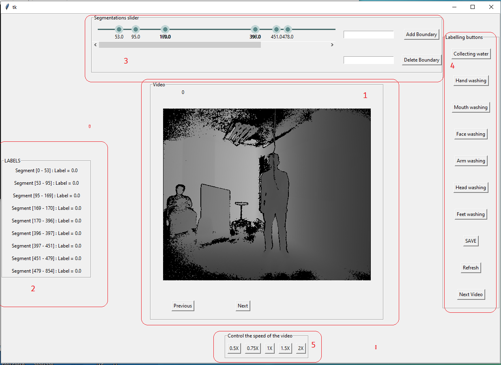

# Wudu-videos-labeler
<h1> This repository is part of the smart tap project </h1>

### Introduction
  This repostiroy hosts the code for the wudu videos labeler. The tool was used to annotate the videos of the wudu actions to then be fed into the machine learning model. The tool requires the user to enter the location of the directory. It will then propose a preliminary annotations for the video. The annotater will go over the annotations and verify them. 
  
 ### Dependencies
 Make sure you have the following dependencies installed before proceeding:
 - Python >=3.7
 - numpy 
 - scipy
 - pillow
### Demo
The tool can be used by cloning the repo and running the main.py file or by using the .exe file directly. You can access the .exe file and the test directory with 3 videos in this  [**link**](https://drive.google.com/drive/folders/1qnUklTRdj-xHcLfkUyCOFWk7Tnmz99Oi?usp=sharing)

The following list will explain the UI of the tool:

  1. Video window: The frames are displayed with two buttons two go between the segmentations
  2. Label window: The labels are tracked in this window
  3. Segmentation slider: Control the segmentations using the slider, can also add or remove a boundary
  4. Labelling buttons: Used to label the current segment displayed in video window
  5. Video speed: Control the speed of the video
